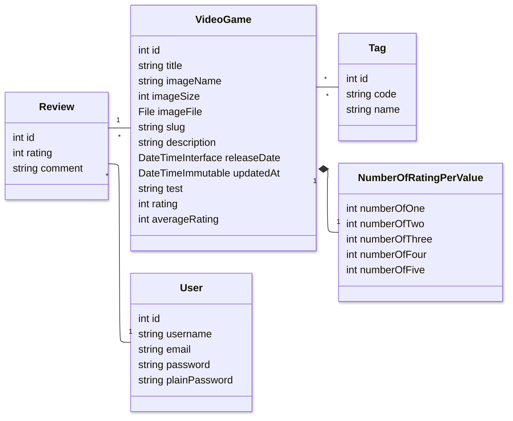

```mermaid
---
config:
  layout: elk
  look: neo
  theme: mc
  fontSize: 50
  class:
    hideEmptyMembersBox: true
  fontFamily: '''Inter Variable'', sans-serif'
  themeVariables:
    fontFamily: '''Inter Variable'', sans-serif'
---
classDiagram
direction LR
class VideoGame {
int id
string title
string imageName
int imageSize
File imageFile
string slug
string description
DateTimeInterface releaseDate
DateTimeImmutable updatedAt
string test
int rating
int averageRating
}

    class Review {
	    int id
	    int rating
	    string comment
    }

    class Tag {
	    int id
	    string code
	    string name
    }

    class User {
	    int id
	    string username
	    string email
	    string password
	    string plainPassword
    }

    class NumberOfRatingPerValue {
	    int numberOfOne
	    int numberOfTwo
	    int numberOfThree
	    int numberOfFour
	    int numberOfFive
    }

    VideoGame "1" *-- "1" NumberOfRatingPerValue
    Review "*" -- "1" VideoGame
    Review "*" -- "1" User
    VideoGame "*" -- "*" Tag
```